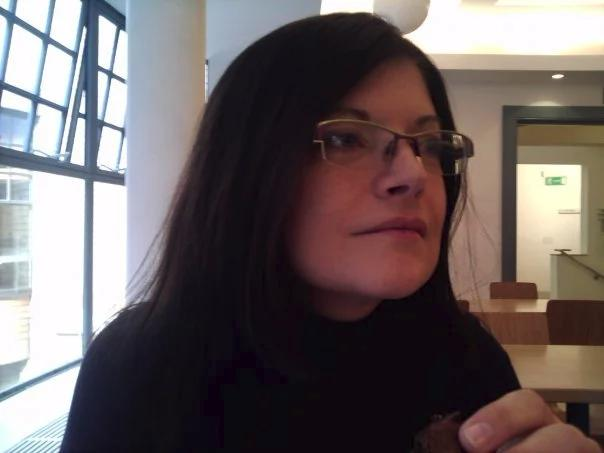

# Melanie Jane Wright (1970-2011)

The picture is of Melanie in the Whitechapel Art Gallery in autumn 2009. She was in the East End undertaking research for her final book, Studying Judaism, London: Continuum, 2012.

Melanie was born on 12th of October 1970 and died on the 29th of January 2011.

Melanie did many things in her life but this site is dedicated to her academic legacy.
